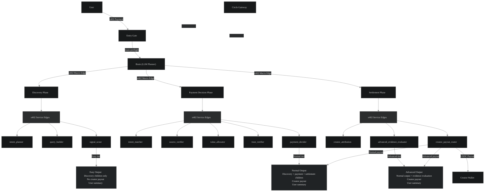

# PayLabs

## Built for Canteen × Circle Lepton Agents Hackathon

PayLabs is autonomous AI agents to agent system that discover sources,
pay for information via x402 nanopayments on Arc,
and distribute USDC micropayments to verified creators.

---

AI search/RSShub discovery + creator monetization platform. Every search is budgeted, every source is paid, every verified creator gets their share.

**For users:** AI-powered source discovery. Ask a question, get answers backed by real sources from across the RSShub, with full transparency on what was searched, which sources were used, and what it cost.

**For creators:** Automatic monetization. Register your GitHub repos, blogs, or domains as sources. When PayLabs uses your content in an answer, you get paid in USDC — no manual invoicing, no chasing payments.

---

## How to Try PayLabs

### User

1. Connect/Login Google to create PayLabs Wallet/DCW
2. If you do not have test USDC, copy your wallet address from the wallet modal and use the `Open Circle Faucet` button.
3. After receiving test USDC, deposit it into Gateway Balance in wallet modal.
4. Once Gateway Balance is ready, submit a query from the chat page.
5. Open Explorer to see the x402 payment flow.

PayLabs uses Gateway Balance for automatic x402 payments. Users do not choose settlement mode manually.

### Creator

1. Open Creator Profile.
2. Connet/Login Google to create Creator Wallet/UCW
3. Register your source URL.
4. Complete the ownership verification step.
5. Once verified, your source can become eligible for creator payouts when used in PayLabs runs.

The Creator Wallet is separate from the PayLabs Wallet. It is used for creator identity, source ownership, and monetization.

---

**Live Stats & Traction:** 
---
**PayLabs is live and actively processing x402-paid searches on Arc testnet.  
Real micropayments flow through the agent runtime, with automatic USDC distribution to verified creators.**

| Metric | Count |
|---|---:|
| Receipts generated across Easy / Normal / Advanced routes | **500+** |
| x402 service payment processed | **3,000+** |
| Users / testers onboarded | **50+** |

- **Live Production:** [https://paylabs.vercel.app/](https://paylabs.vercel.app/)
- **Receipt**: [https://paylabs.vercel.app/explorer](https://paylabs.vercel.app/receipts) 
- **Explorer** : [https://paylabs.vercel.app/explorer](https://paylabs.vercel.app/explorer) 

**Circle Tools Usage:**
---
- **Developer Controlled Wallet:** [DCW API routes](https://github.com/riyannode/Paylabs/tree/main/app/api/paylabs/dcw), [DCW signer adapter](https://github.com/riyannode/Paylabs/blob/main/lib/paylabs/x402/dcw-signer-adapter.ts), [DCW wallet modal design](https://github.com/riyannode/Paylabs/blob/main/components/paylabs/DcwModal.tsx), [User Chat DCW](https://github.com/riyannode/Paylabs/blob/main/app/paylabs-chat-client.tsx)
- **User Controlled Wallet:** [UCW API route](https://github.com/riyannode/Paylabs/tree/main/app/api/paylabs/wallet/ucw), [UCW backend wrapper](https://github.com/riyannode/Paylabs/blob/main/lib/paylabs/ucw.ts), [UCW frontend hook/UI](https://github.com/riyannode/Paylabs/tree/main/components/paylabs)
- **X402 Batching Nanopayment:** [x402 batching challenge, settlement, and receipt helpers](https://github.com/riyannode/Paylabs/tree/main/lib/paylabs/x402)

**Agentic Sophistication**
---
PayLabs runs a **LangGraph-orchestrated agent system** with clear separation between planning and execution:

- A **Brain Planner** (LLM) handles high-level decisions: selecting the appropriate tier, search strategy, and which services to activate.
- A **custom TypeScript runtime** manages budget enforcement, x402 payment edges, Circle DCW signing, Gateway batch settlement, and receipt generation.
- Financial decisions (pricing, value allocation, trust verification, and payout routing) are **hard-locked to deterministic logic**, while the LLM is restricted to advisory and explanatory roles only.

This architecture enables meaningful agent autonomy while maintaining strong safety guarantees around money movement.

Implementation is split across:
- [`lib/paylabs/langgraph`](https://github.com/riyannode/Paylabs/tree/main/lib/paylabs/langgraph) — Brain and macro-node orchestration
- [`lib/paylabs/delegated-runtime`](https://github.com/riyannode/Paylabs/tree/main/lib/paylabs/delegated-runtime) — Quote engine and runtime coordination
- [`lib/paylabs/agent-services`](https://github.com/riyannode/Paylabs/tree/main/lib/paylabs/agent-services) — Individual service implementations
- [`api/paylabs`](https://github.com/riyannode/Paylabs/tree/main/app/api/paylabs) — API

**Innovation**
---
- **PayLabs explores an agent-native economy model where AI search, source discovery, x402 nanopayments, and creator monetization run inside one delegated agent runtime.**

- **The key design insight is separation of authority: the LLM Brain can plan and recommend, but deterministic controllers lock pricing, wallet usage, payment refs, and settlement behavior.**

---

## x402 Raw Header Decode

PayLabs manually implements the x402 HTTP challenge/response flow instead of relying on the SDK's high-level middleware or client wrapper. The application constructs the `PAYMENT-REQUIRED` challenge, decodes the `PAYMENT-SIGNATURE` payload, and manages the payment lifecycle at the HTTP layer while delegating all payment verification and settlement to Circle's official `BatchFacilitatorClient`.

**Why:** The SDK wrapper doesn't return raw signature/settlement data — just `{data, amount, status}`. Using it directly means we can't get the `txHash`/`settlementId` needed to generate an explorer link for every agent-to-agent payment.

Manual decoding lets us trace every payment hop in the hierarchy (user → platform → brain → node → child) to its on-chain transaction in real time — for full audit trail visibility and track all payment link after settlement in [Explorer](https://paylabs.vercel.app/explorer), 

**Implementation:** [Decode](https://github.com/riyannode/Paylabs/blob/main/lib/paylabs/x402/decode-batch.ts), [Link payment](https://github.com/riyannode/Paylabs/blob/main/lib/paylabs/x402/payment-links.ts), [Seller](https://github.com/riyannode/Paylabs/blob/main/lib/paylabs/x402/seller-challenge.ts), [Resolver](https://github.com/riyannode/Paylabs/tree/main/app/api/paylabs/x402)

**Reference:** [the-canteen-dev/circle-agent](https://github.com/the-canteen-dev/circle-agent) — for x402 settlement tracing, Gateway batch visibility, and Arc Testnet explorer proof patterns.

## x402 Settlement Flow

PayLabs uses Circle Gateway's `settle()` endpoint directly for standard seller flows.

**Why:** `settle()` already validates the payment and guarantees settlement in a single request. Calling `verify()` first only adds an extra network round trip and is not recommended, due to its inherent race condition.

Use `verify()` for diagnostics, debugging, or custom preflight validation.

**Reference:** [Circle Gateway — Accept Payments with Nanopayments (Seller Quickstart)](https://developers.circle.com/gateway/nanopayments/quickstarts/seller)

---

## Reusable Arc/Circle x402 SDKs

PayLabs also ships alongside standalone open-source SDKs for builders working with Arc, Circle Gateway, x402 payments, agent wallets, and batch proof visibility.

These SDKs are reusable companion packages. They are not required to run the PayLabs web app, and each package can be used independently.

| SDK | Purpose | Install |
|-----|---------|---------|
| [`x402-batch-codec`](https://github.com/riyannode/x402-batch-codec)  | TypeScript codec for decoding Circle Gateway x402 `submitBatch` transactions on Arc, verifying buyer/seller batch presence, and generating explorer payment proof objects. Codec-only: no signing, no wallet execution, no raw payment headers. | `npm install github:riyannode/x402-batch-codec` |
| [`x402-batch-codec-py`](https://github.com/riyannode/x402-batch-codec-py) | Phyton codec for decoding Circle Gateway x402 `submitBatch` transactions on Arc, verifying buyer/seller batch presence, and generating explorer payment proof objects. Codec-only: no signing, no wallet execution, no raw payment headers. | `pip install git+https://github.com/riyannode/x402-batch-codec-py.git` |
| [`x402-header-agent`](https://github.com/riyannode/x402-header-agent) | TypeScript + native Python SDK for Circle Gateway x402 header payments. Includes buyer/seller helpers, LangChain/CrewAI/custom agent adapters, batch payment helpers, Circle DCW signing, and a dual-role agent wrapper for services that need to receive x402 payments as a seller and spend x402 payments as a buyer. No raw buyer private keys. | `npm install github:riyannode/x402-header-agent` |
| [`deepagent-x402-kit`](https://github.com/riyannode/deepagent-x402-kit) | Python LangChain / Deep Agents kit for ERC-8004 agent identity on Arc plus optional policy-gated Circle x402 tools. One Circle DCW wallet maps to one ERC-8004 agent identity. | `pip install "git+https://github.com/riyannode/deepagent-x402-kit.git"` |

These packages are currently installed directly from GitHub and are not published to npm/PyPI yet. For reproducible installs, pin a commit SHA.

---

## Agent Stack

PayLabs build on a LangGraph Brain planner + custom TypeScript x402 agent runtime.

A user run begins with an **x402 entry payment**. The Brain Planner generates a locked quote and execution plan. It then triggers selected macro-node phases through **x402 macro edges**. Each macro node executes its phase and pays child service nodes via **x402 service**.

Circle Gateway batches these payment edges into `submitBatch` transactions on Arc, while PayLabs records complete receipt and proof metadata for transparency and auditability.




`x402 Macro Edge`
= Paid orchestration transition between macro node phases.

`x402 Service Edge`
= Paid invocation of individual agent services.

**Note:** Settlement has 2 services on Normal (`creator_attribution`, `creator_payout_router`) and 3 services on Advanced, where `advanced_evidence_evaluator` is added for deeper source comparison.

**12 agent services** across 3 macro-node phases:

| Phase | Services | Role |
|-------|----------|------|
| **Discovery** | `intent_planner`, `query_builder`, `signal_scout` / `signal_scout_basics` | Understand user goal, build search queries, discover sources via RSSHub |
| **Payment Decision** | `intent_matcher`, `source_verifier`, `value_allocator`, `trust_verifier`, `payment_decider` | Match sources to intent, verify credibility, allocate value, decide payments |
| **Settlement** | `creator_attribution`, `advanced_evidence_evaluator`, `creator_payout_router` | Attribute sources to verified creators, evaluate evidence quality, route payouts |

**Brain** = LLM planner. Chooses tier, services, search strategy. Advisory only — cannot set prices, wallets, or payment refs.

**Quote Engine** = deterministic pricing. Computes cost from tier + selected services. No LLM-generated prices.

---

## Pricing / Quote Engine

PayLabs uses a deterministic Quote Engine as the single source of truth for pricing and budget validation. The Brain planner can recommend a route, but it cannot set prices, wallet addresses, payment references, or settlement references.

Brain chooses logic. Quote Engine chooses cost.

### Fixed Fees

| Component | Fee |
|---|---:|
| Brain treasury | `0.000003 USDC` |
| Macro-node base fee | `0.000001 USDC` |
| Child service edge | `0.000001 USDC` |
| Registry check | `0.000001 USDC` |
| Source access | `0.000001 USDC` |
| Creator payout unit | `0.000020 USDC` |
| Route preflight fee | `0.000001 USDC` |

### Quote Formula

```txt
execution_fee =
  brain_treasury
  + macro_node_base_fees
  + child_service_edge_fees
  + registry_check_fees
  + source_access_fees

creator_pool =
  creator_payout_unit * creator_slots

locked_quote =
  execution_fee + creator_pool
```

### Base Tier Quotes

These are the base route quotes before additional registry checks, source access, or internal x402 routing volume.

```txt
Easy:
  brain 0.000003
  + 1 macro node * 0.000001
  + 3 child services * 0.000001
  + 0 creator slots
  = 0.000007 USDC base quote

Normal:
  brain 0.000003
  + 3 macro nodes * 0.000001
  + 10 child services * 0.000001
  + 1 creator slot * 0.000020
  = 0.000036 USDC base quote

Advanced:
  brain 0.000003
  + 3 macro nodes * 0.000001
  + 11 child services * 0.000001
  + 2 creator slots * 0.000020
  = 0.000057 USDC base quote
```

Auto-tier: Brain selects optimal tier via two-step preflight (route-preflight → execute-locked).

Expected x402 payment edges:
- Easy: 5 edges = controller→brain + 1 macro edge + 3 child service edges
- Normal: 14 edges = controller→brain + 3 macro edges + 10 child service edges
- Advanced: 15 edges = controller→brain + 3 macro edges + 11 child service edges


### Paid Run Formula

PayLabs uses a paid route preflight before final execution. The preflight locks the selected route, execution plan, quote, and final entry payment before the full agent workflow runs.

```txt
preflight_routing_fee =
  0.000001 USDC

internal_x402_routing =
  macro_node_allocations
  + child_service_payment_edges

gross_run_charge =
  locked_quote
  + internal_x402_routing

final_entry_payment =
  gross_run_charge

total_user_paid =
  preflight_routing_fee
  + final_entry_payment
```

### Budget Guard

```txt
if total_user_paid > user_budget:
  fail closed before final execution
```

This means every paid run is priced deterministically before execution. The route can be selected by the Brain planner, but the final price is locked by the Quote Engine and enforced by the payment runtime.

---

### LLM vs Deterministic per service

Each service supports 3 execution modes: `deterministic` (default), `llm`, `hybrid`.

| Service | LLM-Capable | Default Mode | What LLM does (when enabled) |
|---------|-------------|-------------|------------------------------|
| **Brain planner** | ✅ always LLM | — | Plans tier, strategy, query variants. No deterministic fallback |
| `intent_planner` | ✅ | deterministic | LLM intent classification. Fail → rule-based fallback |
| `query_builder` | ✅ | LLM | LLM query expansion/refinement. Fail → deterministic keyword expansion |
| `signal_scout` | ✅ | LLM | LLM reranks top 20 candidates. Fail → metadata/keyword ranking |
| `signal_scout_basics` | ❌ | deterministic | Pure keyword/entity scoring. No LLM ever |
| `intent_matcher` | ✅ | deterministic | LLM relevance evaluation. Fail → keyword overlap scoring |
| `source_verifier` | ✅ | deterministic | LLM quality assessment. Fail → URL/domain/metadata validation |
| `value_allocator` | ✅ | deterministic | Budget math ALWAYS deterministic. LLM only writes explanation text |
| `trust_verifier` | ✅ | deterministic | Trust checks ALWAYS deterministic. LLM only writes risk summary |
| `payment_decider` | ❌ 🔒 | deterministic | **Hard-locked.** Pure aggregator. No LLM regardless of env |
| `creator_attribution` | ❌ | deterministic | Pure DB query + claim resolver. No LLM ever |
| `advanced_evidence_evaluator` | ✅ | LLM  | Evaluator Agent with 7 tools (memory read/write, source comparison,etc) |
| `creator_payout_router` | ❌ | deterministic | Deterministic split (85/10/5) + ledger. No LLM ever |

9 LLM-capable/Hybrid delegated service agents that run in production:

Each key maps to 
`PAYLABS_LLM_PROVIDER_<KEY>`, `PAYLABS_TUTOR_MODEL_<KEY>`, `PAYLABS_LLM_BASE_URL_<KEY>`, `PAYLABS_LLM_API_KEY_<KEY>`, `PAYLABS_LLM_TIMEOUT_MS_<KEY>`, `PAYLABS_LLM_MAX_TOKENS_<KEY>`.


Key rules:
- `value_allocator` and `trust_verifier`: financial decisions (budget math, trust scores) are ALWAYS deterministic. LLM only generates human-readable explanation text
- `payment_decider`: hard-locked to deterministic — no env var can override
- Every LLM-capable service auto-falls back to deterministic on LLM failure
- `hybrid` mode = deterministic decision + LLM summary text only

---

## Creator Monetization

### How creators earn

```
1. Creator registers a source URL (GitHub repo, blog, domain)
2. Creator verifies ownership (DNS record, repo file, or backlink)
3. PayLabs ingests their content via RSSHub
4. User runs a search that uses the creator's source
5. Creator attribution service classifies eligibility (deterministic, no LLM)
6. Payout executor sends USDC to creator's wallet via x402/Gateway
```


### Creator slot split

PayLabs uses an atomic-safe creator distribution slot.

USDC has 6 decimals, so `0.000001 USDC` is 1 atomic unit. A creator distribution slot is 20 atomic units:

| Recipient | Share | Atomic units | Per slot |
|---|---:|---:|---:|
| Creator | 85% | 17 | 0.000017 USDC |
| Bot | 10% | 2 | 0.000002 USDC |
| Service | 5% | 1 | 0.000001 USDC |
| Total | 100% | 20 | 0.000020 USDC |

This split applies only to the creator distribution slot, not to the full user payment.

Tier slot limits:

| Tier | Creator slots | Creator slot reserve |
|---|---:|---:|
| Easy | 0 | 0.000000 USDC |
| Normal | 1 | 0.000020 USDC |
| Advanced | 2 | 0.000040 USDC |

Only verified creator claims can receive creator payouts. If no verified creator payout is executed, the unused slot remains Treasury / Unallocated. Bot and Service shares are internal platform accounting rows and are paid only for successful creator-paid slots.

### Verification methods

| Method | How it works |
|--------|-------------|
| `well_known_json` | Put `paylabs-verify.json` in your `.well-known/` directory |
| `github_repo_file` | Add `paylabs.json` to your repo root |
| `hosted_link_backlink` | Link back to PayLabs from your public bio/README |
| `manual_review` | Manual approval fallback |

### Claim resolution

When a discovery run finds sources, the **claim resolver** maps each source URL to a verified creator. Resolution priority:

1. `github_repo:<owner>/<repo>` — exact GitHub repo match
2. `platform_profile:<platform>:<handle>` — Twitter, YouTube, Medium, Substack
3. `host:<hostname>` — tenant hosts (`.vercel.app`, `.netlify.app`, `.github.io`)
4. `domain:<hostname>` — domain-level claim (fallback)
5. Exact `canonical_url` match — last resort

No LLM. No network calls. Pure DB query.

### Idempotent payout ledger

Every payout goes through `claim-before-transfer`:

1. `claimPending()` — insert pending row with unique constraint on `(run_id, payout_type, subject_id)`
2. If row already `paid`/`gateway_accepted` → skip (already done)
3. If row already `pending` → fail closed (concurrent claim)
4. Execute real x402 transfer via Circle Gateway
5. `markPaid()` or `markFailed()` — update with real settlement metadata

This prevents double-pay on retry, crash recovery, and concurrent requests.

---

## Wallets

**UCW (User-Controlled Wallet)** — For creators. Social login/Google, and PIN flow for creator onboarding, profile ownership, and source monetization. Circle W3S Web SDK in browser.

**DCW (Developer-Controlled Wallet)** — For chat users / PayLabs payment wallet. Google OAuth, and passkey auth. Paid x402 runs execute synchronously in-request through the app-controlled payment flow.

## Auth

| Method | Implementation |
|--------|---------------|
| Google OAuth | ID token verified via Google `tokeninfo` endpoint |
| WebAuthn Passkey | SimpleWebAuthn, credential stored server-side |

Sessions: JWT via `jose` (Edge-compatible), 7-day httpOnly cookie.

## Pages

| Route | What it does |
|-------|-------------|
| `/` | Chat — ask a question, connect wallet, run search |
| `/explorer` | Payment dashboard — KPIs, x402 events, creator payouts, treasury |
| `/receipts` | Receipt history — per-run breakdown with creators, sources, batch |
| `/source` | Feed items — RSSHub sources with citation/unlock pricing |
| `/creator-dashboard` | Creator onboarding — wallet + profile |
| `/creator-profile` | Creator claims — register, verify, monetize sources |
| `/creator-proof/[claimId]/[nonce]` | Public verification — verified creator badge |

---

> **Accounting note:** Platform x402 Volume represents cumulative gross x402 activity since PayLabs first opened. Treasury / Unallocated represents retained or unallocated ledger entries recorded after the treasury tracking layer was wired on July 2.

## Known Limitations / Next Patch

- **Citation & Retrieval Hardening:** Improving citation grounding and retrieval quality through better source coverage, semantic ranking, query expansion, URL normalization, source reliability, retry handling, and broader RSSHub coverage beyond AI and crypto. citation currently focuses on AI and crypto topic categories.

- **Current limitation:** In some cases, the generated LLM answer is factually correct, but the displayed source links may not directly support the final response because answer generation and source discovery currently follow independent pipelines. but The Brain routing and the complete x402 pipeline for each agent are stable and working as expected.

- **Route Check:** x402 fee can settle before Brain/LLM availability is known.
If Brain/LLM fails afterward, the run fails safely as 504 brain_failed and cannot execute, but the 0.000001 USDC Route Check fee is not refunded.
Accepted for now because the amount is minimal.

- **Wallet:** Login email OTP in backend for UCW and DCW remains due to testing needs, and have so many UCW inline stale and dead code for chat page not clean up yet

## Runtime Notes

- **Some paid runs may take longer to complete:** PayLabs runs multiple backend agent services and several x402 payment edges during a single paid search. This can include Brain planning, macro-node execution, child service calls, source discovery, payment settlement metadata, and receipt generation. If the chat looks stuck or the answer does not appear immediately, please wait. The backend may still be processing the agent workflow and should return the final answer when the run finishes.

- **Receipts and explorer visibility:** After each completed run, PayLabs creates a receipt. The explorer view shows the agent services used, x402 payment edges, settlement metadata, and visibility for each service in the run.

- **Chat Not Working?**
PayLabs chat and Brain planning use local 9Router as the LLM routing layer.
If chat responses, Brain planning, or AI answers stop working, the issue may be related to 9Router access, provider limits, routing, or API key configuration.
Please contact maintainer so the LLM route can be checked.

---

## Tech Stack

| Layer | Technology |
|-------|-----------|
| **Framework** | Next.js 15, React 19, TypeScript |
| **Database** | Supabase (Postgres, RLS) |
| **Agent Runtime** | LangGraph & custom typescript— directed graph orchestration |
| **Wallets** | Circle UCW (creator-facing), Circle DCW (chat user) |
| **Payments** | x402 protocol, Circle Gateway, x402 batching |
| **Blockchain** | Arc Testnet (chain ID 5042002), viem |
| **Sources** | RSShub — feed ingestion, route catalog, live search |
| **Auth** | jose (JWT), Resend (email), SimpleWebAuthn (passkeys) |
| **Validation** | Zod — schemas for all agent service I/O |

## Environment

```bash
# Supabase
NEXT_PUBLIC_SUPABASE_URL
NEXT_PUBLIC_SUPABASE_ANON_KEY
SUPABASE_SERVICE_ROLE_KEY

# Arc
NEXT_PUBLIC_ARC_CHAIN_ID
NEXT_PUBLIC_ARC_RPC_URL
NEXT_PUBLIC_ARC_EXPLORER_URL
NEXT_PUBLIC_ARC_USDC_ADDRESS

# Circle
CIRCLE_API_KEY
CIRCLE_ENTITY_SECRET
NEXT_PUBLIC_CIRCLE_APP_ID
NEXT_PUBLIC_GOOGLE_CLIENT_ID

# Gateway / x402
X402_GATEWAY_ENABLED
X402_GATEWAY_NETWORK
CIRCLE_GATEWAY_API_KEY

# Runtime
PAYLABS_DELEGATED_RUNTIME_ENABLED
PAYLABS_DELEGATED_INLINE_EXECUTION
PAYLABS_AGENT_NANOPAYMENTS_ENABLED
PAYLABS_BRAIN_X402_ENABLED
PAYLABS_NODE_X402_ENABLED
PAYLABS_AUTO_TIER_PREFLIGHT_ENABLED
PAYLABS_APP_URL

# Agent wallets (buyer/seller pairs)
PAYLABS_CONTROLLER_BUYER_WALLET_ID
PAYLABS_BRAIN_BUYER_WALLET_ID
PAYLABS_BRAIN_SELLER_WALLET_ADDRESS
PAYLABS_NODE_DISCOVERY_PLANNER_BUYER_WALLET_ID
PAYLABS_NODE_DISCOVERY_PLANNER_SELLER_WALLET_ADDRESS
PAYLABS_NODE_PAYMENT_DECISION_BUYER_WALLET_ID
PAYLABS_NODE_PAYMENT_DECISION_SELLER_WALLET_ADDRESS
PAYLABS_NODE_SETTLEMENT_MEMORY_BUYER_WALLET_ID
PAYLABS_NODE_SETTLEMENT_MEMORY_SELLER_WALLET_ADDRESS

# Auth
DCW_SESSION_SECRET
RESEND_API_KEY

# RSSHub
PAYLABS_RSSHUB_ENABLED
PAYLABS_RSSHUB_SYNC_SECRET
PAYLABS_RSSHUB_ADMIN_SECRET
PAYLABS_RSSHUB_BASE_URL
PAYLABS_RSSHUB_FALLBACK_BASE_URLS

# LLM
PAYLABS_LLM_REQUIRED=true
PAYLABS_LLM_PROVIDER_DEFAULT
PAYLABS_LLM_BASE_URL_DEFAULT
PAYLABS_LLM_API_KEY_DEFAULT
PAYLABS_TUTOR_MODEL_DEFAULT
PAYLABS_LLM_TIMEOUT_MS_DEFAULT
PAYLABS_LLM_MAX_TOKENS_DEFAULT

# Execution mode (per-service switchable)
PAYLABS_AGENT_SERVICE_EXECUTION_MODE
PAYLABS_AGENT_SERVICE_LLM_ENABLED
PAYLABS_AGENT_SERVICE_EXECUTION_MODE_<AGENT_KEY>
PAYLABS_AGENT_SERVICE_LLM_ENABLED_<AGENT_KEY>
```
> Production note: `PAYLABS_LLM_REQUIRED=true` should be set in production. This makes the Brain planner and LLM-backed services fail closed when LLM credentials are missing or unavailable, instead of silently falling back.

## LLM Configuration

### Per-agent model routing

Each agent can use a different LLM provider, model, and base URL. Resolution:

```
PAYLABS_LLM_<FIELD>_<AGENT_KEY>  →  PAYLABS_LLM_<FIELD>_DEFAULT  →  hardcoded fallback
```

Example — 9Router as default provider:

```bash
# Default provider (OpenAI-compatible proxy)
PAYLABS_LLM_PROVIDER_DEFAULT=openai-compatible
PAYLABS_LLM_BASE_URL_DEFAULT=https://your-9router-endpoint.com/v1
PAYLABS_LLM_API_KEY_DEFAULT=your-api-key
PAYLABS_TUTOR_MODEL_DEFAULT=your-model-name
PAYLABS_LLM_REQUIRED=true

# Override specific agent to use a different model
PAYLABS_TUTOR_MODEL_INTENT_PLANNER=
PAYLABS_LLM_BASE_URL_INTENT_PLANNER=https://your-other-provider.com/v1
PAYLABS_LLM_API_KEY_INTENT_PLANNER=your-other-key
```

### Execution mode switching

Delegated services default to deterministic mode unless these env vars are set. Brain planner is always LLM-assisted. Non-LLM services stay deterministic even when the global mode is `llm`.

```bash
# Repo fallback / safest local mode: no delegated service LLM calls
PAYLABS_AGENT_SERVICE_EXECUTION_MODE=deterministic
PAYLABS_AGENT_SERVICE_LLM_ENABLED=false

# Production default: run LLM-capable delegated services through the LLM path
# Non-LLM services remain deterministic. payment_decider remains hard-locked deterministic.
PAYLABS_AGENT_SERVICE_EXECUTION_MODE_DEFAULT=llm
PAYLABS_AGENT_SERVICE_LLM_ENABLED_DEFAULT=true

# Per-service override: query_builder runs LLM even if the global/default mode differs
PAYLABS_AGENT_SERVICE_EXECUTION_MODE_QUERY_BUILDER=llm
PAYLABS_AGENT_SERVICE_LLM_ENABLED_QUERY_BUILDER=true

# Hybrid mode: deterministic source-of-truth + LLM explanation
# Recommended for value_allocator and trust_verifier.
PAYLABS_AGENT_SERVICE_EXECUTION_MODE_VALUE_ALLOCATOR=hybrid
PAYLABS_AGENT_SERVICE_LLM_ENABLED_VALUE_ALLOCATOR=true
PAYLABS_AGENT_SERVICE_EXECUTION_MODE_TRUST_VERIFIER=hybrid
PAYLABS_AGENT_SERVICE_LLM_ENABLED_TRUST_VERIFIER=true
```


## Development

```bash
pnpm install
pnpm dev          # localhost:3000
pnpm typecheck    # tsc --noEmit
```

## Security

- No local private keys for production execution
- UCW tokens stay server-side, frontend only keeps wallet address/ID
- Raw x402 payloads, signatures, Gateway responses never stored in receipts
- Settlement mode is not user-selectable
- Raw chain-of-thought never exposed
- Creator payout ledger is idempotent — claim-before-transfer prevents double-pay


## License

MIT

