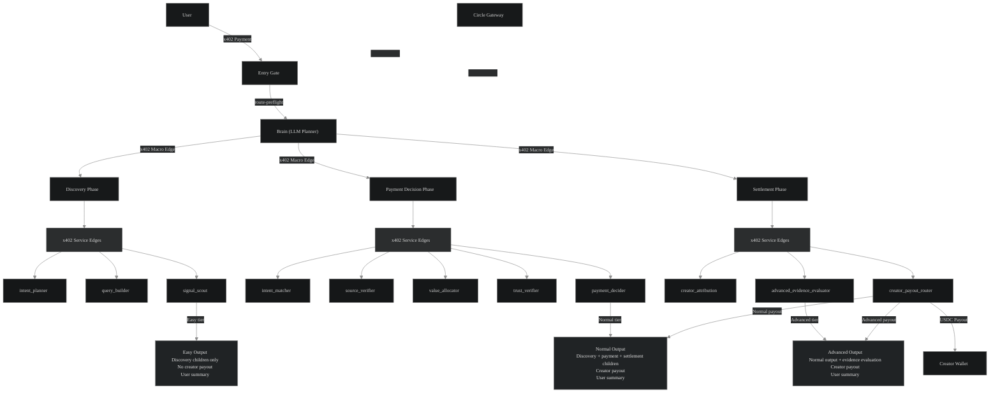

# PayLabs

AI search/crawler + creator monetization platform. Every search is budgeted, every source is paid, every creator gets their share.

Users ask a question, connect a PayLabs payment wallet, run an x402-paid AI search, and get an AI answer — where the creators behind the sources used in that answer automatically receive USDC payouts.

## What PayLabs Does

**For users:** AI-powered source discovery. Ask a question, get answers backed by real sources from across the RSShub, with full transparency on what was searched, which sources were used, and what it cost.

**For creators:** Automatic monetization. Register your GitHub repos, blogs, or domains as sources. When PayLabs uses your content in an answer, you get paid in USDC — no manual invoicing, no chasing payments.


**Live Stats & Traction:** 
------
**PayLabs is live and actively processing x402-paid searches on Arc testnet.  
Real micropayments flow through the agent runtime, with automatic USDC distribution to verified creators.**
- **Live Production:** [https://paylabs.vercel.app/](https://paylabs.vercel.app/)
- **Receipt**: [https://paylabs.vercel.app/explorer](https://paylabs.vercel.app/receipts)
- **Explorer** : [https://paylabs.vercel.app/explorer](https://paylabs.vercel.app/explorer)


**Circle Tools Usage:**
------
- **Developer Controlled Wallet:** [DCW API routes](https://github.com/riyannode/Paylabs/tree/main/app/api/paylabs/dcw), [DCW signer adapter](https://github.com/riyannode/Paylabs/blob/main/lib/paylabs/x402/dcw-signer-adapter.ts), [DCW wallet modal design](https://github.com/riyannode/Paylabs/blob/main/components/paylabs/DcwModal.tsx), [User Chat DCW](https://github.com/riyannode/Paylabs/blob/main/app/paylabs-chat-client.tsx)
- **User Controlled Wallet:** [UCW API route](https://github.com/riyannode/Paylabs/tree/main/app/api/paylabs/wallet/ucw), [UCW backend wrapper](https://github.com/riyannode/Paylabs/blob/main/lib/paylabs/ucw.ts), [UCW frontend hook/UI](https://github.com/riyannode/Paylabs/tree/main/components/paylabs)
- **X402 Batching Nanopayment:** [x402 batching challenge, settlement, and receipt helpers](https://github.com/riyannode/Paylabs/tree/main/lib/paylabs/x402), [Quote Engine](https://github.com/riyannode/Paylabs/blob/main/lib/paylabs/delegated-runtime/quote-engine.ts)

**Agentic Sophistication**
-----
- **LangGraph Brain:** [lib/paylabs/langgraph/brain](https://github.com/riyannode/Paylabs/tree/main/lib/paylabs/langgraph/brain)
- **LangGraph Macro Nodes:** [lib/paylabs/langgraph/macro-nodes](https://github.com/riyannode/Paylabs/tree/main/lib/paylabs/langgraph/macro-nodes)
- **LangGraph Service Nodes:** [lib/paylabs/langgraph/services](https://github.com/riyannode/Paylabs/tree/main/lib/paylabs/langgraph/services)
- **LangGraph Shared State:** [lib/paylabs/langgraph/shared](https://github.com/riyannode/Paylabs/tree/main/lib/paylabs/langgraph/shared)
- **Delegated Runtime Orchestrator:** [lib/paylabs/delegated-runtime](https://github.com/riyannode/Paylabs/tree/main/lib/paylabs/delegated-runtime)
- **Delegated Agent Services:** [lib/paylabs/agent-services](https://github.com/riyannode/Paylabs/tree/main/lib/paylabs/agent-services)

**Innovation**
-----
- **PayLabs explores an agent-native economy model where AI search, source discovery, x402 nanopayments, and creator monetization run inside one delegated agent runtime.**

- **The key design insight is separation of authority: the LLM Brain can plan and recommend, but deterministic controllers lock pricing, wallet usage, payment refs, and settlement behavior.**


## Agent Stack

PayLabs runs on a LangGraph Brain planner + custom TypeScript x402 agent runtime.

A user starts with an x402 entry payment. The Brain creates a locked quote and execution plan, then pays selected macro-node phases through x402. Each macro node runs a LangGraph phase and pays its child service nodes through x402 service edges. Circle Gateway batch these x402 payment edges into Arc explorer submitBatch transactions, while PayLabs records safe receipt and proof metadata.



Note: Settlement has 2 services on Normal (`creator_attribution`, `creator_payout_router`) and 3 services on Advanced, where `advanced_evidence_evaluator` is added for deeper source comparison.

**12 agent services** across 3 macro-node phases:

| Phase | Services | Role |
|-------|----------|------|
| **Discovery** | `intent_planner`, `query_builder`, `signal_scout` / `signal_scout_basics` | Understand user goal, build search queries, discover sources via RSSHub |
| **Payment Decision** | `intent_matcher`, `source_verifier`, `value_allocator`, `trust_verifier`, `payment_decider` | Match sources to intent, verify credibility, allocate value, decide payments |
| **Settlement** | `creator_attribution`, `advanced_evidence_evaluator`, `creator_payout_router` | Attribute sources to verified creators, evaluate evidence quality, route payouts |

**Brain** = LLM planner. Chooses tier, services, search strategy. Advisory only — cannot set prices, wallets, or payment refs.

**Quote Engine** = deterministic pricing. Computes cost from tier + selected services. No LLM-generated prices.

### LLM vs Deterministic per service

Each service supports 3 execution modes: `deterministic` (default), `llm`, `hybrid`.

| Service | LLM-Capable | Default Mode | What LLM does (when enabled) |
|---------|-------------|-------------|------------------------------|
| **Brain planner** | ✅ always LLM | — | Plans tier, strategy, query variants. No deterministic fallback |
| `intent_planner` | ✅ | deterministic | LLM intent classification. Fail → rule-based fallback |
| `query_builder` | ✅ | LLM | LLM query expansion/refinement. Fail → deterministic keyword expansion |
| `signal_scout` | ✅ | LLM | LLM reranks top 20 candidates. Fail → metadata/keyword ranking |
| `signal_scout_basics` | ❌ | deterministic | Pure keyword/entity scoring. No LLM ever |
| `intent_matcher` | ✅ | deterministic | LLM relevance evaluation. Fail → keyword overlap scoring |
| `source_verifier` | ✅ | deterministic | LLM quality assessment. Fail → URL/domain/metadata validation |
| `value_allocator` | ✅ | deterministic | Budget math ALWAYS deterministic. LLM only writes explanation text |
| `trust_verifier` | ✅ | deterministic | Trust checks ALWAYS deterministic. LLM only writes risk summary |
| `payment_decider` | ❌ 🔒 | deterministic | **Hard-locked.** Pure aggregator. No LLM regardless of env |
| `creator_attribution` | ❌ | deterministic | Pure DB query + claim resolver. No LLM ever |
| `advanced_evidence_evaluator` | ✅ | LLM  | Deep Agent with 7 tools (memory read/write, source comparison) |
| `creator_payout_router` | ❌ | deterministic | Deterministic split (85/10/5) + ledger. No LLM ever |

Key rules:
- `value_allocator` and `trust_verifier`: financial decisions (budget math, trust scores) are ALWAYS deterministic. LLM only generates human-readable explanation text
- `payment_decider`: hard-locked to deterministic — no env var can override
- Every LLM-capable service auto-falls back to deterministic on LLM failure
- `hybrid` mode = deterministic decision + LLM summary text only

## Creator Monetization

### How creators earn

```
1. Creator registers a source URL (GitHub repo, blog, domain)
2. Creator verifies ownership (DNS record, repo file, or backlink)
3. PayLabs ingests their content via RSSHub
4. User runs a search that uses the creator's source
5. Creator attribution service classifies eligibility (deterministic, no LLM)
6. Payout executor sends USDC to creator's wallet via x402/Gateway
```


### Creator slot split

PayLabs uses an atomic-safe creator distribution slot.

USDC has 6 decimals, so `0.000001 USDC` is 1 atomic unit. A creator distribution slot is 20 atomic units:

| Recipient | Share | Atomic units | Per slot |
|---|---:|---:|---:|
| Creator | 85% | 17 | 0.000017 USDC |
| Bot | 10% | 2 | 0.000002 USDC |
| Service | 5% | 1 | 0.000001 USDC |
| Total | 100% | 20 | 0.000020 USDC |

This split applies only to the creator distribution slot, not to the full user payment.

Tier slot limits:

| Tier | Creator slots | Creator slot reserve |
|---|---:|---:|
| Easy | 0 | 0.000000 USDC |
| Normal | 1 | 0.000020 USDC |
| Advanced | 2 | 0.000040 USDC |

Only verified creator claims can receive creator payouts. If no verified creator payout is executed, the unused slot remains Treasury / Unallocated. Bot and Service shares are internal platform accounting rows and are paid only for successful creator-paid slots.

### Verification methods

| Method | How it works |
|--------|-------------|
| `well_known_json` | Put `paylabs-verify.json` in your `.well-known/` directory |
| `github_repo_file` | Add `paylabs.json` to your repo root |
| `hosted_link_backlink` | Link back to PayLabs from your public bio/README |
| `manual_review` | Manual approval fallback |

### Claim resolution

When a discovery run finds sources, the **claim resolver** maps each source URL to a verified creator. Resolution priority:

1. `github_repo:<owner>/<repo>` — exact GitHub repo match
2. `platform_profile:<platform>:<handle>` — Twitter, YouTube, Medium, Substack
3. `host:<hostname>` — tenant hosts (`.vercel.app`, `.netlify.app`, `.github.io`)
4. `domain:<hostname>` — domain-level claim (fallback)
5. Exact `canonical_url` match — last resort

No LLM. No network calls. Pure DB query.

### Idempotent payout ledger

Every payout goes through `claim-before-transfer`:

1. `claimPending()` — insert pending row with unique constraint on `(run_id, payout_type, subject_id)`
2. If row already `paid`/`gateway_accepted` → skip (already done)
3. If row already `pending` → fail closed (concurrent claim)
4. Execute real x402 transfer via Circle Gateway
5. `markPaid()` or `markFailed()` — update with real settlement metadata

This prevents double-pay on retry, crash recovery, and concurrent requests.

## Route Tiers

| Tier | Macro Nodes | Creator Slots | Use Case |
|------|------------|---------------|----------|
| **Easy** | discovery_planner | 0 | Quick source discovery, no creator payout |
| **Normal** | discovery_planner, payment_decision, settlement_memory | 1 | Source-backed answer with creator attribution and 1 creator payout slot |
| **Advanced** | discovery_planner, payment_decision, settlement_memory | 2 | Deep evidence evaluation with up to 2 creator payout slots | 

Auto-tier: Brain selects optimal tier via two-step preflight (route-preflight → execute-locked).

Expected x402 payment edges:
- Easy: 5 edges = controller→brain + 1 macro edge + 3 child service edges
- Normal: 14 edges = controller→brain + 3 macro edges + 10 child service edges
- Advanced: 15 edges = controller→brain + 3 macro edges + 11 child service edges


## Payment Flow

```
User starts an x402-paid run through the PayLabs payment wallet/DCW
  → Brain plans tier + services
  → Quote engine prices the run (deterministic)
  → Agent wallets pay macro nodes + child services via x402
  → Creator attribution identifies eligible creators
  → Payout executor sends USDC to creator wallets
  → Receipt generated with full payment graph
```

## Wallets

**UCW (User-Controlled Wallet)** — For creators. Social login, email OTP, and PIN flow for creator onboarding, profile ownership, and source monetization. Circle W3S Web SDK in browser.

**DCW (Developer-Controlled Wallet)** — For chat users / PayLabs payment wallet. Google OAuth, email OTP, and passkey auth. Paid x402 runs execute synchronously in-request through the app-controlled payment flow.

## Auth

| Method | Implementation |
|--------|---------------|
| Google OAuth | ID token verified via Google `tokeninfo` endpoint |
| Email OTP | 6-digit code, SHA-256 hashed, 5min TTL, Resend delivery |
| WebAuthn Passkey | SimpleWebAuthn, credential stored server-side |

Sessions: JWT via `jose` (Edge-compatible), 7-day httpOnly cookie.

## Pages

| Route | What it does |
|-------|-------------|
| `/` | Chat — ask a question, connect wallet, run search |
| `/explorer` | Payment dashboard — KPIs, x402 events, creator payouts, treasury |
| `/receipts` | Receipt history — per-run breakdown with creators, sources, batch |
| `/source` | Feed items — RSSHub sources with citation/unlock pricing |
| `/creator-dashboard` | Creator onboarding — wallet + profile |
| `/creator-profile` | Creator claims — register, verify, monetize sources |
| `/creator-proof/[claimId]/[nonce]` | Public verification — verified creator badge |

> **Accounting note:** Platform x402 Volume represents cumulative gross x402 activity since PayLabs first opened. Treasury / Unallocated represents retained or unallocated ledger entries recorded after the treasury tracking layer was wired on July 2.

## Known Limitations / Next Patch

- **Advanced scraper link hardening:** PayLabs already supports the main source discovery and paid agent flow, but advanced scraper deep-link coverage still needs one follow-up patch for broader URL normalization, retries, and edge-case source formats.
- If the chat looks stuck or the answer does not appear immediately, please wait. 
The backend may still be processing and should return the final answer when the run finishes.
After each completed run, we also creates a receipt. The explorer view shows the services used, payment edges, settlement metadata, and visibility for each service in the run.

## Tech Stack

| Layer | Technology |
|-------|-----------|
| **Framework** | Next.js 15, React 19, TypeScript |
| **Database** | Supabase (Postgres, RLS) |
| **Agent Runtime** | LangChain / LangGraph — directed graph orchestration |
| **Wallets** | Circle UCW (creator-facing), Circle DCW (chat user) |
| **Payments** | x402 protocol, Circle Gateway, x402 batching |
| **Blockchain** | Arc Testnet (chain ID 5042002), viem |
| **Sources** | RSShub — feed ingestion, route catalog, live search |
| **Auth** | jose (JWT), Resend (email), SimpleWebAuthn (passkeys) |
| **Validation** | Zod — schemas for all agent service I/O |

## Environment

```bash
# Supabase
NEXT_PUBLIC_SUPABASE_URL
NEXT_PUBLIC_SUPABASE_ANON_KEY
SUPABASE_SERVICE_ROLE_KEY

# Arc
NEXT_PUBLIC_ARC_CHAIN_ID
NEXT_PUBLIC_ARC_RPC_URL
NEXT_PUBLIC_ARC_EXPLORER_URL
NEXT_PUBLIC_ARC_USDC_ADDRESS

# Circle
CIRCLE_API_KEY
CIRCLE_ENTITY_SECRET
NEXT_PUBLIC_CIRCLE_APP_ID
NEXT_PUBLIC_GOOGLE_CLIENT_ID

# Gateway / x402
X402_GATEWAY_ENABLED
X402_GATEWAY_NETWORK
CIRCLE_GATEWAY_API_KEY

# Runtime
PAYLABS_DELEGATED_RUNTIME_ENABLED
PAYLABS_DELEGATED_INLINE_EXECUTION
PAYLABS_AGENT_NANOPAYMENTS_ENABLED
PAYLABS_BRAIN_X402_ENABLED
PAYLABS_NODE_X402_ENABLED
PAYLABS_AUTO_TIER_PREFLIGHT_ENABLED
PAYLABS_APP_URL

# Agent wallets (buyer/seller pairs)
PAYLABS_CONTROLLER_BUYER_WALLET_ID
PAYLABS_BRAIN_BUYER_WALLET_ID
PAYLABS_BRAIN_SELLER_WALLET_ADDRESS
PAYLABS_NODE_DISCOVERY_PLANNER_BUYER_WALLET_ID
PAYLABS_NODE_DISCOVERY_PLANNER_SELLER_WALLET_ADDRESS
PAYLABS_NODE_PAYMENT_DECISION_BUYER_WALLET_ID
PAYLABS_NODE_PAYMENT_DECISION_SELLER_WALLET_ADDRESS
PAYLABS_NODE_SETTLEMENT_MEMORY_BUYER_WALLET_ID
PAYLABS_NODE_SETTLEMENT_MEMORY_SELLER_WALLET_ADDRESS

# Auth
DCW_SESSION_SECRET
RESEND_API_KEY

# RSSHub
PAYLABS_RSSHUB_ENABLED
PAYLABS_RSSHUB_SYNC_SECRET
PAYLABS_RSSHUB_ADMIN_SECRET
PAYLABS_RSSHUB_BASE_URL
PAYLABS_RSSHUB_FALLBACK_BASE_URLS

# LLM
PAYLABS_LLM_REQUIRED
PAYLABS_LLM_PROVIDER_DEFAULT
PAYLABS_LLM_BASE_URL_DEFAULT
PAYLABS_LLM_API_KEY_DEFAULT
PAYLABS_TUTOR_MODEL_DEFAULT
PAYLABS_LLM_TIMEOUT_MS_DEFAULT
PAYLABS_LLM_MAX_TOKENS_DEFAULT

# Execution mode (per-service switchable)
PAYLABS_AGENT_SERVICE_EXECUTION_MODE
PAYLABS_AGENT_SERVICE_LLM_ENABLED
PAYLABS_AGENT_SERVICE_EXECUTION_MODE_<AGENT_KEY>
PAYLABS_AGENT_SERVICE_LLM_ENABLED_<AGENT_KEY>
```

## LLM Configuration

### Per-agent model routing

Each agent can use a different LLM provider, model, and base URL. Resolution:

```
PAYLABS_LLM_<FIELD>_<AGENT_KEY>  →  PAYLABS_LLM_<FIELD>_DEFAULT  →  hardcoded fallback
```

Example — 9Router as default provider:

```bash
# Default provider (OpenAI-compatible proxy)
PAYLABS_LLM_PROVIDER_DEFAULT=openai-compatible
PAYLABS_LLM_BASE_URL_DEFAULT=https://your-9router-endpoint.com/v1
PAYLABS_LLM_API_KEY_DEFAULT=your-api-key
PAYLABS_TUTOR_MODEL_DEFAULT=your-model-name
PAYLABS_LLM_REQUIRED=true

# Override specific agent to use a different model
PAYLABS_TUTOR_MODEL_INTENT_PLANNER=gpt-4o-mini
PAYLABS_LLM_BASE_URL_INTENT_PLANNER=https://your-other-provider.com/v1
PAYLABS_LLM_API_KEY_INTENT_PLANNER=your-other-key
```

### Execution mode switching

```bash
# All services deterministic (default — no LLM calls)
PAYLABS_AGENT_SERVICE_EXECUTION_MODE=deterministic
PAYLABS_AGENT_SERVICE_LLM_ENABLED=false

# All services LLM-enabled
PAYLABS_AGENT_SERVICE_EXECUTION_MODE=llm
PAYLABS_AGENT_SERVICE_LLM_ENABLED=true

# Per-service override (e.g. only intent_planner uses LLM)
PAYLABS_AGENT_SERVICE_EXECUTION_MODE_INTENT_PLANNER=llm
PAYLABS_AGENT_SERVICE_LLM_ENABLED_INTENT_PLANNER=true

# Hybrid mode — deterministic decision + LLM explanation
PAYLABS_AGENT_SERVICE_EXECUTION_MODE_SIGNAL_SCOUT=hybrid
PAYLABS_AGENT_SERVICE_LLM_ENABLED_SIGNAL_SCOUT=true
```

### Agent keys

9 LLM-capable delegated service agents that run in production:

| Agent Key | Phase | LLM-Capable |
|-----------|-------|-------------|
| `brain_planner` | Brain | ✅ always LLM |
| `intent_planner` | Discovery | ✅ |
| `query_builder` | Discovery | ✅ |
| `signal_scout` | Discovery | ✅ |
| `intent_matcher` | Payment Decision | ✅ |
| `source_verifier` | Payment Decision | ✅ |
| `value_allocator` | Payment Decision | ✅ |
| `trust_verifier` | Payment Decision | ✅ |
| `advanced_evidence_evaluator` | Settlement | ✅ |

Each key maps to `PAYLABS_LLM_PROVIDER_<KEY>`, `PAYLABS_TUTOR_MODEL_<KEY>`, `PAYLABS_LLM_BASE_URL_<KEY>`, `PAYLABS_LLM_API_KEY_<KEY>`, `PAYLABS_LLM_TIMEOUT_MS_<KEY>`, `PAYLABS_LLM_MAX_TOKENS_<KEY>`.

## Development

```bash
pnpm install
pnpm dev          # localhost:3000
pnpm typecheck    # tsc --noEmit
```

## Security

- No local private keys for production execution
- UCW tokens stay server-side, frontend only keeps wallet address/ID
- Raw x402 payloads, signatures, Gateway responses never stored in receipts
- Settlement mode is not user-selectable
- Raw chain-of-thought never exposed
- Creator payout ledger is idempotent — claim-before-transfer prevents double-pay

---

## Reusable Arc/Circle x402 SDKs

PayLabs also ships alongside standalone open-source SDKs for builders working with Arc, Circle Gateway, x402 payments, agent wallets, and batch proof visibility.

These SDKs are reusable companion packages. They are not required to run the PayLabs web app, and each package can be used independently.

| SDK | Purpose | Install |
|-----|---------|---------|
| [`x402-batch-codec`](https://github.com/riyannode/x402-batch-codec) | TypeScript codec for decoding Circle Gateway x402 `submitBatch` transactions on Arc, verifying buyer/seller batch presence, and encoding safe batch proof objects. Codec-only: no signing, no wallet execution, no raw payment headers. | `npm install github:riyannode/x402-batch-codec` |
| [`x402-header-agent`](https://github.com/riyannode/x402-header-agent) | TypeScript + native Python SDK for Circle Gateway x402 header payments. Includes buyer/seller helpers, LangChain/CrewAI/custom agent adapters, batch payment helpers, and Circle DCW signing. No raw buyer private keys. | `npm install github:riyannode/x402-header-agent` |
| [`deepagent-x402-kit`](https://github.com/riyannode/deepagent-x402-kit) | Python LangChain / Deep Agents kit for ERC-8004 agent identity on Arc plus optional policy-gated Circle x402 tools. One Circle DCW wallet maps to one ERC-8004 agent identity. | `pip install "git+https://github.com/riyannode/deepagent-x402-kit.git"` |

These packages are currently installed directly from GitHub and are not published to npm/PyPI yet. For reproducible installs, pin a commit SHA.

## License

MIT

