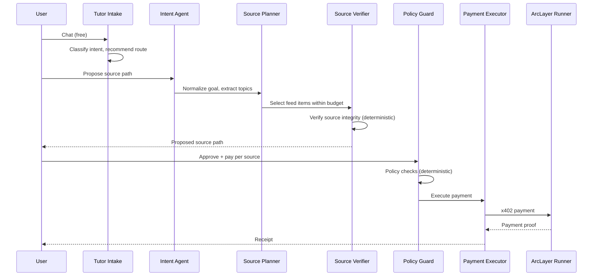

# PayLabs

RSSHub-first source discovery, AI source paths, and x402 source payments on [Arc](https://arc.network).

## What it does

PayLabs discovers content through [RSSHub](https://docs.rsshub.app/) routes, builds AI-curated source paths, and executes per-citation payments via [Circle Gateway](https://www.circle.com/en/gateway) on Arc testnet.


## Architecture

| Layer | Role |
|---|---|
| **RSSHub Routes** | Source registry — any RSSHub-compatible feed |
| **Feed Items** | Normalized content with SHA-256 hashes |
| **Source Paths** | AI-curated ordered lists of feed items |
| **Source Payments** | Per-citation/unlock payments to creators |
| **Route Payments** | Tiny x402 tolls before AI proposal |
| **Agent Payments** | Agent-to-agent service payments (RFB 03) |
| **Agent Actions** | Policy audit trail |

## Agent Workflow



## Safety Rules

- **Runner is the only payment executor** — no local private keys, no direct Circle calls
- **No fake payment IDs** — every payment must come from Runner with complete proof
- **No fake tx hashes** — Runner returns real settlement refs
- **No DB-only unlocks** — payment must complete before status changes
- **No secrets in logs** — API keys, wallet keys, HMAC secrets are never printed
- **Backend loads price/wallet/URL from DB** — LLM never sets financial fields

## API Endpoints

| Method | Path | Description |
|---|---|---|
| `GET` | `/api/paylabs/health` | Health check |
| `GET` | `/api/paylabs/feed-items` | List active feed items |
| `POST` | `/api/paylabs/rsshub/routes` | Register RSSHub route |
| `POST` | `/api/paylabs/rsshub/sync` | Sync feed items from RSSHub |
| `POST` | `/api/paylabs/tutor/chat` | Free intent classification |
| `POST` | `/api/paylabs/source-paths/propose` | Propose AI source path |
| `POST` | `/api/paylabs/source-paths/:id/approve` | Approve source path |
| `POST` | `/api/paylabs/source-payments/pay` | Pay for source citation |
| `GET` | `/api/paylabs/creator` | Creator earnings |
| `GET` | `/api/paylabs/dashboard` | Dashboard data |

## Database

Single migration: `supabase/migrations/1_rsshub.sql`

| Table | Purpose |
|---|---|
| `paylabs_rsshub_routes` | RSSHub source registry |
| `paylabs_feed_items` | Normalized content items |
| `paylabs_source_paths` | AI-curated source paths |
| `paylabs_source_path_items` | Items in a source path |
| `paylabs_route_payments` | Route toll payments |
| `paylabs_source_payments` | Per-citation source payments |
| `paylabs_agent_payments` | Agent-to-agent service payments |
| `paylabs_agent_actions` | Policy audit trail |

## Route Tiers

| Tier | Max Sources | Description |
|---|---|---|
| `normal` | 2 | Easy path — cheapest and fastest |
| `advanced` | 5 | Builder path — balanced |
| `premium` | 8 | Expert path — deep research |

## Tech Stack

- **Next.js 15** — App Router
- **LangGraph** — Multi-agent workflow
- **Supabase** — Postgres + RLS
- **Circle Gateway** — USDC settlement on Arc
- **ArcLayer Runner** — Payment execution boundary
- **RSSHub** — Open-source content source

## Development

```bash
pnpm install
pnpm dev          # http://localhost:3000
pnpm typecheck
pnpm build
```

## Environment Variables

See `.env.example` for required configuration.
