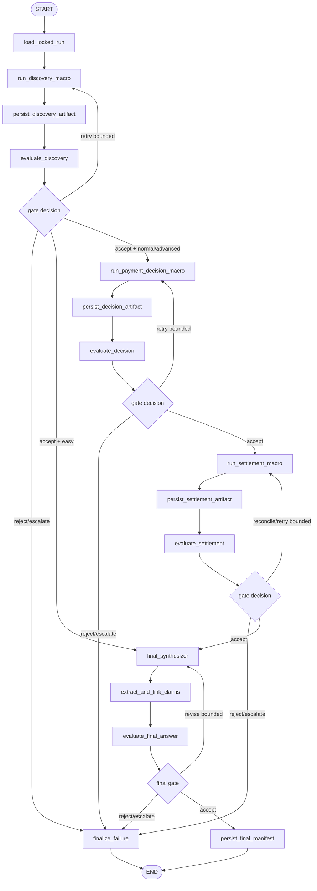

# PayLabs LangGraph-Native Graph Engineering PRD

**Status:** Proposed — future implementation  
**Repository:** `riyannode/Paylabs`  
**Target stack:** TypeScript, LangChain/LangGraph, PostgreSQL/Supabase, existing Circle Gateway x402 runtime  
**Document type:** Architecture and phased implementation PRD  
**Last updated:** 2026-08-01

## 1. Executive decision

PayLabs will use **LangGraph as the only workflow graph engine** for future graph-engineering work.

This decision means:

- `@langchain/langgraph` remains the canonical execution/orchestration runtime.
- The existing Brain, Discovery, Payment Decision, and Settlement graphs become subgraphs of one durable parent run graph.
- PostgreSQL/Supabase is used as storage for LangGraph checkpoints, immutable business artifacts, operation ledgers, and public-safe projections. It is not a second workflow engine.
- No Neo4j, NetworkX runtime, CrewAI graph, Temporal workflow, or custom replacement graph engine is introduced.
- Existing x402, Circle Gateway, DCW/UCW, pricing, route locking, creator payout, receipt, and settlement logic remain deterministic and outside LLM authority.
- LangGraph checkpoints are not treated as the accounting ledger. Payment and payout ledgers remain the source of truth for financial effects.

The design translates the graph-engineering source material into two complementary structures:

1. **Execution lineage:** LangGraph nodes, edges, threads, checkpoints, subgraphs, attempts, and operation IDs answer what ran, in which order, and what resumed.
2. **Domain provenance:** typed immutable artifacts and relational links answer which sources support a claim, which evaluator approved an output, and which payment or receipt belongs to a business purpose.

These structures are connected, but they are not collapsed into one database object or one unbounded graph.

## 2. Why PayLabs needs this

PayLabs already has a mature agentic payment runtime:

- a LangGraph Brain planner;
- three macro phases;
- twelve child services;
- paid Brain-to-macro and macro-to-service x402 edges;
- deterministic quote, budget, payment, creator attribution, and payout controls;
- receipts, transaction links, Office events, and Explorer visibility.

The remaining problem is not adding more agents. It is making execution state, retries, artifacts, evaluation, and provenance explicit enough that a run can safely resume without repeating financial effects.

The current architecture has four separate LangGraph graphs, while the outer locked macro orchestration is still a custom TypeScript loop. The graphs are compiled without a production checkpointer on `main`. Service nodes perform external paid calls and generate random edge IDs inside node execution. Many state fields append with concatenating reducers. Those patterns work for one-pass execution, but they are unsafe foundations for checkpoint replay because a resumed node can otherwise produce duplicate evaluations, events, artifacts, or payment attempts.

An open PR, #121, adds an optional PostgreSQL checkpointer only to the Brain graph. It is a useful experiment, but it does not solve full-run durability, side-effect idempotency, macro graph persistence, reducer deduplication, flow versioning, or payment reconciliation. It should be superseded by the phased plan in this PRD rather than merged unchanged.

## 3. Source interpretation

The attached Graph Engineering study note is used as a conceptual checklist, not as an official Karpathy or Anthropic specification. Its applicable principles are:

- start from a measurable loop rather than a large autonomous swarm;
- make actions bounded and reversible;
- retain durable lineage instead of replaying full transcripts;
- separate execution lineage from domain knowledge;
- store artifacts and evaluations as versioned records;
- construct bounded, task-specific context instead of dumping an entire graph;
- declare budgets, retry limits, evidence requirements, and stopping rules;
- trace important outputs to an objective, plan, artifact, source, evaluation, and bounded execution record.

Official LangGraph documentation remains authoritative for checkpointer, thread, subgraph, retry, replay, and migration behavior.

## 4. Goals

### 4.1 Product goals

1. Resume an interrupted paid run from durable state without charging or paying twice.
2. Make every user-visible final answer traceable to evaluated source artifacts.
3. Make every payment traceable to a run operation and business purpose.
4. Preserve current Easy, Normal, and Advanced behavior and pricing unless a later PR explicitly changes economics.
5. Give Explorer a bounded, public-safe execution/evidence/money provenance view.
6. Allow graph code to evolve without breaking in-flight runs.

### 4.2 Engineering goals

1. Replace the custom outer macro loop with a parent `StateGraph` behind a feature flag.
2. Compile the parent graph with `PostgresSaver` and stable thread identity.
3. Use per-invocation macro subgraphs that inherit the parent checkpointer.
4. Isolate external calls and financial effects into deterministic, idempotent tasks/nodes.
5. Replace append-only state accumulation with deterministic upsert reducers.
6. Store large or long-lived outputs as immutable artifacts; keep checkpoints bounded.
7. Add deterministic evaluation gates before optional LLM evaluators.
8. Add explicit flow and schema versions to every durable run.

## 5. Non-goals

This roadmap does not:

- replace Circle Gateway or x402;
- change USDC amounts, quote formulas, tier fees, wallet selection, or payout formulas;
- give an LLM authority to select final prices, sign, settle, transfer, or override policy;
- introduce a property-graph database;
- use LangGraph checkpoints as a financial ledger;
- expose raw prompts, chain-of-thought, payment signatures, EIP-712 payloads, wallet secrets, API keys, or raw Gateway responses;
- load the entire global provenance graph into an LLM or browser;
- turn time-travel replay into a way to re-execute live payments;
- migrate every historical row in the first implementation PR;
- change the existing public API contract before a guarded rollout.

## 6. Current-state assessment

### 6.1 Existing LangGraph assets

PayLabs currently contains:

- `lib/paylabs/langgraph/brain/brain-planner-graph.ts`
- `lib/paylabs/langgraph/macro-nodes/discovery-planner-graph.ts`
- `lib/paylabs/langgraph/macro-nodes/payment-decision-graph.ts`
- `lib/paylabs/langgraph/macro-nodes/settlement-memory-graph.ts`
- `lib/paylabs/langgraph/shared/state.ts`
- `lib/paylabs/langgraph/services/service-node.ts`

The current graphs are valuable and should be evolved, not replaced.

### 6.2 Existing orchestration boundary

`lib/paylabs/delegated-runtime/locked-orchestration.ts` currently owns the outer macro sequence after preflight and final entry payment. It manually:

- iterates locked macro nodes;
- constructs payload handoffs;
- calls each macro endpoint through x402;
- appends macro and child payment edges;
- builds progress summaries;
- fails or returns output.

This loop is the correct target for a parent LangGraph because it is already a bounded, deterministic sequence over a locked plan.

### 6.3 Existing financial idempotency

PayLabs already has a creator payout ledger with claim-before-transfer semantics and a unique payout key. That pattern must be generalized to every external side effect, not replaced.

### 6.4 Current durability gaps

| Gap | Current risk | Required correction |
|---|---|---|
| Brain-only checkpoint proposal | Macro and service work cannot safely resume | Parent graph checkpointer plus inherited subgraphs |
| External paid call inside service node | Re-execution can repeat a payment attempt | Deterministic operation ledger and reconciliation |
| Random UUID payment edge IDs | Retry creates logically duplicate edges | Deterministic edge/operation IDs |
| Concatenating reducers | Resume/retry can append duplicate records | Upsert-by-ID reducers and bounded lists |
| Brain creates an answer before evidence | Planning text may be mistaken for final grounded output | Post-evidence final synthesizer |
| Custom outer loop | No durable parent execution lineage | `PayLabsRunGraph` |
| Checkpoint state may contain arbitrary service output | State growth and accidental sensitive retention | Artifact references and safe serializer policy |
| No flow version contract | New graph code can break old checkpoints | Persisted `flowVersion` and compatibility rules |

## 7. Target architecture

### 7.1 Five planes

PayLabs will use five explicit planes.

#### Control plane

Receives a paid, locked objective; loads the locked plan; starts or resumes the correct graph version; applies budgets, retry ceilings, and stopping rules.

#### Execution plane

LangGraph parent graph and macro subgraphs execute deterministic nodes, LLM calls, source retrieval, and paid service invocations.

#### Artifact plane

Stores immutable plans, ranked candidates, source evaluations, attribution outputs, final answer versions, claim records, and evaluation records.

#### Provenance plane

Stores or projects typed links among operations, artifacts, sources, claims, payments, settlements, creators, and receipts. This is a relational read model, not a second workflow runtime.

#### Evaluation plane

Runs deterministic validation first, optional model evaluation second, and returns typed decisions such as `accept`, `revise`, `retry`, `reject`, or `escalate`.

### 7.2 HTTP payment gates remain outside the graph

The initial HTTP 402 challenge/retry exchange should remain at the route boundary because the first unpaid request has not yet authorized execution.

The sequence remains:

1. Route returns an x402 challenge.
2. Client retries with payment authorization.
3. Route verifies and settles through the existing Circle path.
4. Route persists safe settlement metadata.
5. Route invokes or resumes the correct LangGraph thread.

The graph receives a safe payment reference, not the raw signature or Gateway response.

### 7.3 Canonical graphs

#### A. `PayLabsPreflightGraph`

Runs after the routing payment is settled.


Responsibilities:

- normalize objective;
- run Brain planning;
- validate and lock route tier, macro nodes, and services;
- compute the canonical quote through existing deterministic code;
- persist `flowVersion`, locked plan artifact, routing payment reference, and safe Brain diagnostics.

It does not run macro nodes or creator payout.

#### B. `PayLabsRunGraph`

Runs after the final entry payment is settled.



Responsibilities:

- own end-to-end durable execution lineage;
- invoke existing macro graphs as subgraphs or paid macro-call nodes;
- persist artifact references after each phase;
- evaluate phase outputs;
- generate the final answer only after evidence is available;
- record claims, source links, evaluations, financial references, and final manifest;
- return the same public-safe response contract during rollout.

### 7.4 Macro subgraphs

The existing Discovery, Payment Decision, and Settlement graphs remain independently testable subgraphs.

Recommended persistence mode:

- parent graph: durable `PostgresSaver`;
- macro subgraphs: per-invocation persistence inherited from the parent;
- no per-thread memory for macro subgraphs unless a later use case explicitly requires multi-turn macro memory;
- no parallel invocation of the same per-thread subgraph namespace.

### 7.5 Final synthesizer

The Brain planner remains a planner. Its pre-retrieval `assistant_response` is treated as advisory and never as the authoritative final result.

The final synthesizer consumes only bounded, public-safe artifact inputs:

- normalized goal;
- locked route tier;
- top evaluated source artifacts;
- approved/rejected evidence summary;
- contradictions and uncertainty;
- creator attribution summary;
- payment/receipt status references where relevant to the user request.

It produces:

- versioned final answer artifact;
- typed claim list;
- source citations by stable source/artifact ID;
- explicit inference labels;
- uncertainty and missing-evidence notes;
- safe user-facing summary.

In the first version, claim contribution does **not** change payout amounts or eligibility. Any future contribution-weighted payout is a separate economics PR.

## 8. Durable state model

### 8.1 Thread identity

Recommended thread IDs:

- preflight: `pl:preflight:<discoveryRunId>:<flowVersion>`
- paid run: `pl:run:<discoveryRunId>:<flowVersion>`

The same paid run must always resume with the same thread ID. A new thread ID creates a new execution identity and must not inherit the original run's payment authorization.

### 8.2 Flow versioning

Every durable run stores:

- `flowVersion`
- `stateSchemaVersion`
- `artifactSchemaVersion`
- `ontologyVersion`
- `rubricVersions`
- `createdWithCommitSha` when available

Rules:

- add state fields as optional/defaulted first;
- keep deprecated node names and state keys for at least one drain window;
- rename through add, dual-read/dual-write, drain, then remove;
- never silently route an in-flight paid thread into new business economics;
- persist the selected `flowVersion` during preflight and continue that business behavior on resume.

### 8.3 Parent state

The parent checkpoint should contain compact, JSON-serializable state.

```ts
interface PayLabsRunState {
  flowVersion: string;
  stateSchemaVersion: number;
  discoveryRunId: string;
  threadId: string;

  objective: SafeObjective;
  lockedPlanRef: ArtifactRef;
  routeTier: "easy" | "normal" | "advanced";
  budgetPolicy: BoundedRunBudget;

  phaseStatus: Record<PhaseName, PhaseStatus>;
  operationsById: Record<string, OperationRef>;
  artifactsById: Record<string, ArtifactRef>;
  evaluationsById: Record<string, EvaluationRef>;
  paymentsById: Record<string, SafePaymentRef>;

  retryCounts: Record<string, number>;
  activeNode?: string;
  finalManifestRef?: ArtifactRef;
  terminalStatus?: "completed" | "failed" | "escalated";
  safeErrors: SafeGraphError[];
}
```

Do not store:

- raw `PAYMENT-SIGNATURE`;
- raw EIP-712 authorization;
- private keys or wallet credentials;
- API keys or provider tokens;
- raw Gateway payloads;
- hidden chain-of-thought;
- unbounded source bodies;
- full historical event streams.

### 8.4 Reducers

Replace concatenation for durable identity-bearing objects.

Required patterns:

- `operationsById`: upsert by deterministic `operationId`;
- `artifactsById`: upsert by `artifactId`;
- `evaluationsById`: upsert by `evaluationId`;
- `paymentsById`: upsert by canonical payment ID;
- progress entries: bounded by maximum count and stable sequence ID;
- source candidates: deduplicate by canonical source identity and preserve deterministic ranking order.

A reducer must be associative, deterministic, and safe when the same update is applied more than once.

## 9. Operation identity and side-effect safety

### 9.1 Operation contract

Every node or task with an external effect receives a deterministic operation identity.

```ts
interface DurableOperation {
  operationId: string;
  idempotencyKey: string;
  correlationId: string;
  causationId?: string;
  discoveryRunId: string;
  flowVersion: string;
  nodeName: string;
  operationType: OperationType;
  canonicalInputHash: string;
  attempt: number;
}
```

The hash must exclude secrets and volatile values that do not change the business operation.

### 9.2 Operation lifecycle

Minimum states:

- `planned`
- `claimed`
- `executing`
- `succeeded`
- `failed_retryable`
- `failed_terminal`
- `reconciliation_required`
- `reconciled`

### 9.3 External effect algorithm

For every paid macro or service call:

1. Derive deterministic operation and idempotency IDs.
2. Read or claim the operation row transactionally.
3. If `succeeded`, return the stored safe result.
4. If status is ambiguous, reconcile against existing payment/event/settlement data.
5. Execute only when the operation is eligible for a new attempt.
6. Persist the external result and canonical financial reference.
7. Return a JSON-serializable task result to LangGraph.
8. Let the graph checkpoint the reference.

A checkpointer reduces repeated computation, but it does not by itself guarantee exactly-once external effects. The operation ledger and existing payout/payment reconciliation are authoritative.

### 9.4 Retry policy

Apply retries by error class.

| Node class | Automatic retry | Rule |
|---|---:|---|
| Pure deterministic transformation | Yes | Safe and bounded |
| LLM structured generation | Yes | Bounded attempts, schema validation |
| Source/network read | Yes | Transient network/rate-limit only |
| Database read | Yes | Transient connection/serialization only |
| Artifact upsert | Yes | Deterministic ID required |
| x402 payment/settlement | No blind retry | Reconcile first, then controlled retry |
| Creator payout | No blind retry | Existing payout ledger is authoritative |
| Office/UI event | Yes | Idempotent event key/upsert |

### 9.5 Replay and time travel

Production policy:

- normal recovery resumes the same thread from the latest safe checkpoint;
- admin replay of historical checkpoints is read-only by default;
- a fork that may perform external actions must use a new run identity and fresh authorization;
- payment, settlement, and payout nodes must refuse live execution when runtime mode is `replay_read_only`;
- the Explorer may display historical state without invoking nodes.

## 10. Artifact and provenance model

### 10.1 Immutable artifact envelope

```ts
interface AgentArtifact<T> {
  artifactId: string;
  artifactType: ArtifactType;
  schemaVersion: number;
  discoveryRunId: string;
  operationId: string;
  producer: {
    graph: string;
    node: string;
    macro?: string;
    service?: string;
    model?: string;
  };
  parentArtifactIds: string[];
  inputHash: string;
  outputHash: string;
  evidenceRefs: EvidenceRef[];
  createdAt: string;
  payload: T;
}
```

Artifacts are immutable. Corrections create a new artifact linked by `SUPERSEDES` or `REVISES`.

### 10.2 Minimum artifact types

- `objective`
- `brain_plan`
- `locked_plan`
- `quote`
- `discovery_candidates`
- `source_evaluation`
- `payment_decision`
- `creator_attribution`
- `advanced_evidence_evaluation`
- `creator_payout_result`
- `final_answer`
- `claim_set`
- `evaluation`
- `run_manifest`

### 10.3 Logical provenance nodes

- Objective
- Plan
- Run
- MacroRun
- ServiceRun
- Artifact
- Source
- Claim
- Evaluation
- Creator
- Payment
- Settlement
- Transaction
- Receipt

### 10.4 Logical provenance edges

- `PLANNED_AS`
- `LOCKED_BY`
- `EXECUTED_BY`
- `INVOKED`
- `DEPENDS_ON`
- `PRODUCED`
- `DERIVED_FROM`
- `SUPPORTS`
- `CONTRADICTS`
- `EVALUATED_BY`
- `APPROVED_BY`
- `REJECTED_BY`
- `ATTRIBUTED_TO`
- `OWNED_BY`
- `PAID_FOR`
- `SETTLED_BY`
- `RECORDED_IN`
- `REVISES`
- `SUPERSEDES`

### 10.5 Invariants

1. Every claim has at least one source-backed relation or is explicitly labeled `INFERENCE`.
2. Every artifact has a producer operation, schema version, input hash, and output hash.
3. Every evaluation identifies a versioned rubric.
4. Every external financial effect has an operation ID and business purpose.
5. Every creator payout links to a creator, eligible source or attribution artifact, settlement result, and receipt/ledger record.
6. Superseded artifacts remain addressable.
7. No public projection contains secret or raw authorization data.
8. No edge is written unless both endpoint identities validate against the ontology.

### 10.6 Storage decision

Use PostgreSQL/Supabase tables for canonical business records and a projection for Explorer.

Recommended canonical tables:

- `paylabs_operations`
- `paylabs_agent_artifacts`
- `paylabs_artifact_links`
- `paylabs_evaluations`

Existing payment, payout, receipt, source, creator, and run tables remain canonical for their domains.

Recommended public-safe projection tables:

- `paylabs_provenance_nodes`
- `paylabs_provenance_edges`
- `paylabs_projection_offsets`

The projection is rebuildable and must never block settlement.

## 11. Evaluation gates

### 11.1 Decision schema

```ts
type EvaluationDecision =
  | "accept"
  | "revise"
  | "retry"
  | "reject"
  | "escalate";

interface EvaluationArtifact {
  evaluationId: string;
  targetArtifactId: string;
  evaluatorType: "deterministic" | "model" | "human";
  evaluatorName: string;
  rubricVersion: string;
  decision: EvaluationDecision;
  score?: number;
  defects: EvaluationDefect[];
  evidenceRefs: EvidenceRef[];
  retryable: boolean;
  safeRationale: string;
  createdAt: string;
}
```

### 11.2 Gate order

1. Schema and invariant validation.
2. Deterministic policy and budget checks.
3. Source/evidence support checks.
4. Optional LLM evaluator when judgment is required.
5. Controller validates the permitted route.

An evaluator may recommend; it cannot sign, settle, alter pricing, or bypass deterministic policy.

### 11.3 Initial rubrics

- Discovery completeness and query-intent preservation.
- Source validity, freshness, and relevance.
- Payment decision consistency with deterministic scores and budget.
- Creator attribution eligibility and proof status.
- Final answer claim support, contradictions, inference labeling, and citation validity.

## 12. Context construction

The graph must not become a new form of context dumping.

For final synthesis or evaluation:

- resolve only entities and sources relevant to the objective;
- load current artifact versions;
- include one or two bounded provenance hops;
- prioritize recent verified claims and current source artifacts;
- include contradictions and uncertainty;
- serialize under an explicit token/character budget;
- include stable source, claim, and artifact IDs;
- never include raw checkpoint history or full service transcripts by default.

## 13. Budgets and stopping rules

Every run declares bounded limits before execution:

- maximum LangGraph node attempts;
- maximum LLM calls;
- maximum source reads;
- maximum registry checks;
- maximum external paid operations;
- maximum wall-clock time;
- maximum model tokens/cost;
- maximum artifact writes;
- maximum evaluation revisions;
- minimum evidence required for finalization.

When a budget is exhausted, the graph returns:

- best current safe artifact;
- completed phases;
- unresolved defects;
- financial effects already completed;
- reason for stopping;
- safe recovery or escalation status.

It must not hide partial failure behind a fluent answer.

## 14. Security and privacy

### 14.1 Checkpointer configuration

- server-side PostgreSQL connection string only;
- never `NEXT_PUBLIC_*` credentials;
- connection pooling and TLS as required by the deployment environment;
- setup migration run before feature enablement;
- restricted database role;
- explicit retention and cleanup job;
- separate public-safe read APIs rather than direct checkpoint access.

### 14.2 Redaction rules

The checkpoint serializer, artifact adapters, logs, and projections must reject or redact:

- payment signatures;
- EIP-712 authorization fields not required for a safe reference;
- raw Gateway responses;
- wallet credentials and wallet IDs not intended for public display;
- provider API keys/tokens;
- session cookies;
- hidden reasoning;
- raw copyrighted source bodies beyond permitted snippets.

### 14.3 Access model

- internal operation/artifact/checkpoint tables: server role only;
- user read endpoints: capability/session scoped to the run;
- Explorer: public-safe labels, hashes, statuses, transaction links, and bounded evidence metadata;
- no arbitrary graph query endpoint exposed to anonymous clients.

## 15. Explorer target

Explorer should present separate bounded views rather than one unreadable global force graph.

### Execution

`objective → locked plan → macro run → service run → artifact → evaluation → status`

### Evidence

`final claim → supporting/contradicting source → evaluation → confidence/status`

### Money flow

`entry payment → routing/Brain/macro/service purpose → settlement/transaction → payout → receipt`

### Creator attribution

`creator → verified source → source use → attribution artifact → payout result`

### Full provenance

A bounded cross-domain path for one run, claim, source, payment, or receipt.

Requirements:

- query by one run or starting node;
- maximum depth and node count;
- deterministic ordering;
- no secret fields;
- direct transaction and receipt links;
- clear pending, failed, reconciled, and settled states;
- existing Explorer tables remain available during rollout.

## 16. Observability

Minimum metrics:

- graph starts, completions, failures, interruptions, and resumes;
- resume success rate;
- duplicate operation claims;
- duplicate financial effects detected;
- reconciliation-required count and duration;
- node attempts and retry exhaustion;
- checkpoint count and serialized bytes per run;
- artifact count and payload bytes per run;
- evaluation decisions and revision counts;
- unsupported or contradicted claim rate;
- source citation validity;
- total latency by phase;
- LLM usage/cost by phase;
- x402 settled count and amount, compared with existing receipts;
- stale or incompatible in-flight flow versions.

Critical invariants should alert immediately:

- more than one successful effect for one idempotency key;
- payout amount or count differs from canonical ledger;
- final answer accepted with unsupported factual claims;
- run completed without a final manifest;
- checkpoint contains forbidden field classes;
- projection references missing canonical records.

## 17. Rollout strategy

### Stage 0 — Documentation and contracts

No runtime behavior change.

### Stage 1 — Shadow artifacts and projections

Create immutable artifacts and provenance projections from existing events. Projection failures cannot fail payment execution.

### Stage 2 — Checkpoint-enabled non-financial nodes

Enable Brain and pure/LLM transformation checkpoints for an allowlisted environment or wallet set.

### Stage 3 — Parent graph with existing paid adapters

Enable `PayLabsRunGraph` for a small allowlist. Paid nodes use operation claims and reconciliation before any retry.

### Stage 4 — Tier matrix on Arc Testnet

Run real paid Easy, Normal, and Advanced executions with real Circle Gateway/DCW flows and validate receipts, transaction links, and resume behavior.

### Stage 5 — Gradual production enablement

Increase allowlist/percentage only when duplicate-effect count remains zero and accounting parity is exact.

### Rollback rule

- Before final entry payment: route may fall back to the old path if no durable run was created.
- After payment and thread creation: do not switch engines mid-run. Resume the persisted `flowVersion` or escalate safely.
- Keep old node names and state compatibility until all in-flight threads drain.

Recommended feature flags:

- `PAYLABS_LANGGRAPH_CHECKPOINT_ENABLED`
- `PAYLABS_LANGGRAPH_RUN_V2_ENABLED`
- `PAYLABS_LANGGRAPH_FINAL_SYNTHESIZER_ENABLED`
- `PAYLABS_PROVENANCE_PROJECTION_ENABLED`

## 18. Mandatory validation

### 18.1 Deterministic and integration validation

- operation IDs and hashes are stable;
- secrets are excluded from canonical hashes;
- reducers are idempotent under repeated updates;
- artifact IDs and links do not duplicate;
- old checkpoints load under additive state changes;
- checkpointer enabled/disabled modes are covered;
- per-run thread isolation is verified;
- projection replay is idempotent;
- final claim gate rejects unsupported factual claims.

### 18.2 Failure-injection validation

Inject process termination or timeout at these points:

1. after routing payment settles but before preflight result checkpoint;
2. after macro x402 settlement but before task result is checkpointed;
3. after child service success but before artifact upsert;
4. after artifact upsert but before graph update;
5. after creator payout ledger success but before settlement graph completion;
6. during final synthesizer revision loop;
7. during projection transaction;
8. concurrent resume attempts for the same thread.

Expected result: the run resumes or reconciles without duplicate service effects, payments, payouts, artifacts, or events.

### 18.3 Required live Arc Testnet matrix

For each tier — Easy, Normal, Advanced:

- execute a real paid run using configured PayLabs wallets and Circle Gateway;
- verify route/preflight and final entry payments;
- verify expected Brain, macro, and child service payment edges;
- verify creator payout behavior for applicable tiers;
- verify transaction and batch resolver links;
- verify receipt accounting matches canonical ledgers;
- terminate one run after a confirmed payment and resume it;
- confirm the settled count and amount do not increase for the already-completed operation;
- confirm the final manifest traces objective, plan, artifacts, sources, evaluations, payments, and receipt;
- inspect persisted checkpoints for forbidden fields.

No production rollout is accepted from typecheck or local-only evidence alone.

## 19. Revised 10-PR implementation plan

The uploaded PR1–PR10 roadmap has the right themes. The sequence below is revised to fit the current PayLabs codebase and LangGraph durability constraints.

### PR 1 — LangGraph run contracts, ontology, and flow versioning

Add:

- typed operation/artifact/evaluation/provenance contracts;
- logical node and edge ontology;
- allowed relation matrix;
- `flowVersion`, schema versions, and compatibility policy;
- deterministic canonical JSON utilities;
- no migration and no runtime behavior change.

Exit criteria:

- no `any` in new contracts;
- invalid links fail validation;
- same canonical input serializes identically;
- no x402 or pricing changes.

### PR 2 — Deterministic operation identity and idempotency adapters

Add:

- operation ID, idempotency key, correlation ID, causation ID;
- stable IDs for Brain, macro, service, source access, payment, payout, artifact, and event operations;
- adapters that can read existing payout/payment outcomes;
- no automatic payment behavior change yet.

Exit criteria:

- same business operation yields the same key;
- material input or flow version changes the key;
- secrets never enter the hash;
- random IDs are removed from new durable paths.

### PR 3 — Immutable artifacts, evaluations, and dedup reducers

Add:

- `AgentArtifact<T>` and `EvaluationArtifact`;
- adapters for current macro/service outputs;
- upsert-by-ID reducers;
- bounded progress/event state;
- compatibility return shapes for current APIs.

Exit criteria:

- repeated graph updates do not duplicate state;
- artifacts are immutable and hash-verifiable;
- no required database write in the critical payment path.

### PR 4 — Production PostgresSaver foundation

Supersede PR #121 with:

- `@langchain/langgraph-checkpoint-postgres`;
- server-only checkpointer factory and setup script;
- stable thread IDs;
- parent-compatible graph compilation;
- per-invocation macro subgraph policy;
- checkpoint redaction tests;
- retention/cleanup design;
- enabled/disabled parity.

Exit criteria:

- Brain and a non-financial macro graph resume from PostgreSQL;
- run threads are isolated;
- no raw payment authorization or secrets are persisted.

### PR 5 — Parent `PayLabsRunGraph` behind a feature flag

Add the durable parent graph while reusing current macro endpoints and public response shape.

Exit criteria:

- custom outer sequence is represented as LangGraph nodes/edges;
- Easy, Normal, Advanced select the same locked macro/service bundles;
- flag disabled equals current behavior;
- no financial retry is enabled before PR 6.

### PR 6 — Side-effect tasks, payment reconciliation, and crash-safe resume

Add:

- operation claim table or equivalent canonical ledger;
- `task()`/node wrappers for external calls;
- reconcile-before-retry logic;
- deterministic event and payment IDs;
- controlled retry policies by error class;
- crash-injection tests.

Exit criteria:

- no duplicate payment after termination at every specified boundary;
- creator payout ledger remains authoritative;
- concurrent resume attempts resolve to one effect.

### PR 7 — Evaluation gates and final synthesizer

Add:

- phase evaluation artifacts;
- deterministic validators first;
- optional model evaluators;
- bounded revise/retry routes;
- post-evidence final synthesizer;
- typed claims with support, contradiction, inference, and unsupported status.

Exit criteria:

- Brain pre-retrieval response is not authoritative;
- unsupported factual claims cannot pass the final gate;
- evaluators cannot move money or change pricing.

### PR 8 — Canonical artifact persistence and provenance projection

Add additive tables for operations, artifacts, links, evaluations, and projection offsets. Project existing run/payment/receipt/source/creator records asynchronously.

Exit criteria:

- projector replay is idempotent;
- projection failure cannot fail settlement;
- historical runs can be backfilled;
- canonical financial tables remain unchanged.

### PR 9 — Bounded provenance query APIs

Add server-side APIs for Execution, Evidence, Money Flow, Creator Attribution, and Full Provenance views.

Exit criteria:

- run/capability scoped access;
- maximum depth and node count;
- public-safe fields only;
- deterministic pagination/order;
- no direct checkpoint table exposure.

### PR 10 — Explorer graph UI, observability, and rollout completion

Add bounded Explorer views, graph/runtime metrics, compatibility dashboards, and release controls.

Exit criteria:

- existing Explorer remains functional;
- transaction and receipt links remain accessible;
- mobile layout works;
- live Arc Testnet tier matrix passes;
- production rollout criteria and rollback playbook are documented.

## 20. Mapping from the uploaded draft roadmap

| Uploaded draft | Revised destination |
|---|---|
| Canonical Graph Ontology | PR 1 |
| Durable Operation Identity | PR 2 |
| Artifact Envelope | PR 3 |
| Persistent Graph Schema | PR 8, after durable contracts are proven |
| Graph Projection Writer | PR 8 |
| Checkpoint and Retry Safety | PR 4 plus PR 6 |
| Payment Purpose Linking | PR 2, PR 6, and PR 8 |
| Final Synthesizer and Claim-Source Graph | PR 7 |
| Evaluation Gates | PR 7 |
| Explorer Graph UI | PR 9 and PR 10 |

The primary sequencing change is deliberate: do not expand checkpointing across paid nodes until deterministic operation identity, dedup reducers, and artifact contracts exist.

## 21. Acceptance criteria for the complete program

The graph-engineering program is complete only when all of the following are true:

1. One parent LangGraph thread represents one locked paid run.
2. Every macro and service operation has deterministic identity.
3. A crash after a confirmed external effect does not repeat that effect.
4. Every important output is an immutable, versioned artifact.
5. Every final factual claim is supported, contradicted, or explicitly marked inference.
6. Every evaluation has a versioned rubric and typed decision.
7. Every payment has a purpose and links to its operation and receipt/settlement record.
8. Creator payouts remain exactly-once according to the existing payout ledger.
9. Checkpoint state contains no forbidden secret or authorization data.
10. In-flight graph versions remain resumable across deployments.
11. Explorer queries bounded public-safe provenance rather than raw checkpoints.
12. Real Arc Testnet Easy, Normal, and Advanced runs pass accounting and recovery validation.
13. Existing production behavior remains available behind rollback controls until the new path is proven.
14. Duplicate financial effect count remains zero throughout staged rollout.

## 22. Open decisions before implementation

1. Exact checkpoint retention window and cleanup ownership.
2. Whether the final synthesizer is an internal Brain model call or a separately named non-paid service; it must not change current pricing in the first version.
3. Whether operation records use a new table or extend an existing event/ledger table. A new narrow table is preferred for clean uniqueness semantics.
4. Which existing response fields remain compatibility aliases during the transition.
5. How long old node/state names are retained before checkpoint drain is considered complete.
6. Whether historical provenance backfill covers all runs or only runs with complete safe metadata.

## 23. Reference links

- LangGraph repository: `https://github.com/langchain-ai/langgraph`
- LangGraph persistence: `https://docs.langchain.com/oss/javascript/langgraph/persistence`
- LangGraph subgraphs: `https://docs.langchain.com/oss/javascript/langgraph/use-subgraphs`
- LangGraph Functional API and tasks: `https://docs.langchain.com/oss/javascript/langgraph/functional-api`
- LangGraph Graph API and retry policies: `https://docs.langchain.com/oss/javascript/langgraph/use-graph-api`
- LangGraph backward compatibility: `https://docs.langchain.com/oss/javascript/langgraph/backward-compatibility`
- Current PayLabs graph code: `lib/paylabs/langgraph`
- Current outer locked runtime: `lib/paylabs/delegated-runtime/locked-orchestration.ts`
- Existing payout idempotency reference: PR #79
- Existing Brain-only checkpoint experiment: PR #121
